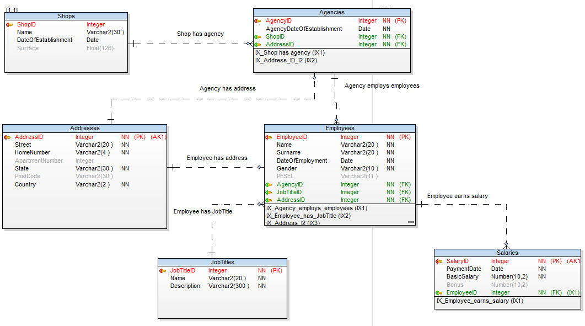

# JavaFX Oracle Database App
Main purpose of this project is to manage data from Oracle 11g database on Warsaw University of Technology servers.     
( Created in a weekend to confirm SQL/Oracle/JavaFX knowledge. )

## Build using :
---
* [Oracle SQL Developer](https://www.oracle.com/pl/database/technologies/appdev/sql-developer.html)
* [JPhoenix](http://www.jfoenix.com/)
* [Scene Builder](https://gluonhq.com/products/scene-builder/)
* [Toad Data Modeler 6.5](https://www.quest.com/products/toad-data-modeler/)
* [Oracle Database 11g Release 2](https://www.oracle.com/technetwork/database/enterprise-edition/downloads/112010-win64soft-094461.html) - on WUT servers.

## Models
---

Logical Model           |  Conceptual Model
:-------------------------:|:-------------------------:
  |  

## Features
---
* Two types of user account ( Admin and User)
* Showing Shops, Agencies and Employees including their attributes. [**BOTH**]
* Extra attribute in shop view - getting number of agencies belong to shop company.[**BOTH**]
* Removing from database Shop, Agency or Employee.[**ADMIN**]
* Adding new Employee into database.[**ADMIN**]
* Handle SQLException by JPanel with SQL error code and description.[**ADMIN**]

## Future updates
---
* Getting data via dynamic database view
* Replace static sql requests and use functions implementen in Oracle database
